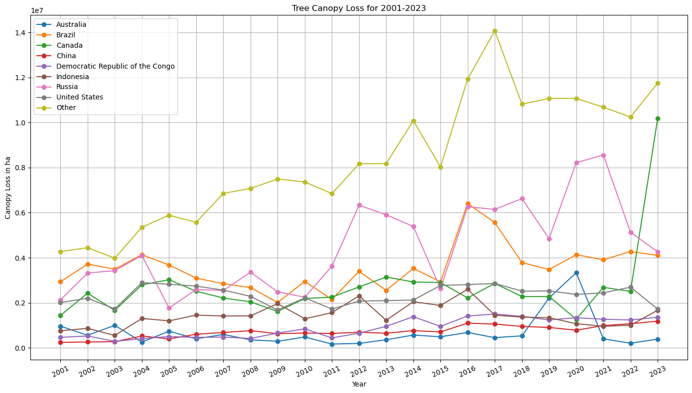

# Deforestation Risk Analysis Using Satellite Data

### Project Overview
Using historical satellite data, this project analyzes deforestation risks by studying patterns in carbon emissions and tree canopy density changes. It aims to identify high-risk areas and develop a predictive model to support conservation strategies.

### Goals
- Analyze forest changes, focusing on carbon fluctuations and tree cover density.
- Build a predictive model to identify areas at risk for deforestation.

### Installation and Setup
- Editor: Jupyter Notebook
- Python Version: 3.12.4
- Key Libraries:
	- Data Manipulation: `pandas`, `NumPy`
	- Data Visualization: `matplotlib`, `seaborn`
	- Machine Learning: `scikit-learn`, `statmodels`

### Data
The main datasets were retrieved from [Global Forest Watch](https://www.globalforestwatch.org/) which tracks real-time environmental data:
- Tree Canopy Loss Data (2001-2023)
- Carbon Emissions Data (2000-2023)

### Preprocessing 
- null values in carbon emissions data with thresholds below 30%

### EDA Findings
- Strong correlation between carbon emissions and tree canopy loss.
- Most carbon is stored in primary forests which are areas that are most of interest for logging
- Most recent highest carbon emitters were Brazil, US and Canada. (Canada marked the highest carbon emitter in 2023 due to its catastrophic wildfire that turned the air orange)
- Tree cover loss has become more sporadic overtime and can be explained by global warming events being a main contributor to wildfires

### Models
- Linear regression models were used as a baseline to try and capture the predictive power of net carbon emissions and net tree cover loss. Lasso regression was later used to optimize the performance of this model
-  Evaluation metrics used were mean squared error (MSE), mean absolute error (MAE) and R-squared. 

### Analysis
- A strong correlation was found between carbon emissions and tree density loss suggesting that areas with high emissions are likely experiencing significant deforestation as well as a driver that 2 separate models can potentially explain a similar problem
- Leveraging historical carbon and forest data, the model can be used to make predictions for countries or potentially areas with higher granularity like subnational regions or cities as the models focus on dense forests where the forested areas are represented by country forest data

### Results
Net Carbon Emissions Model Performance: 83.81%  
Tree Density Gain Model Performance: 97.82%

### Future Work
- Integrating additional datasets (e.g., climate, economic activity)
- Integrating upcoming 2024 carbon and tree density data
- Additional Model experimentation to evaluate other models performance
